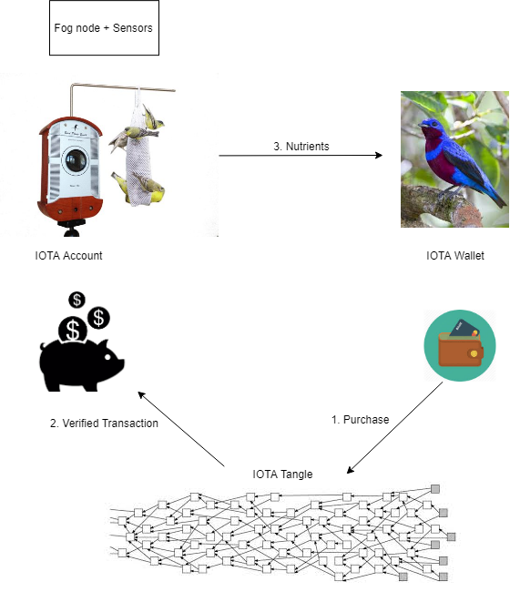
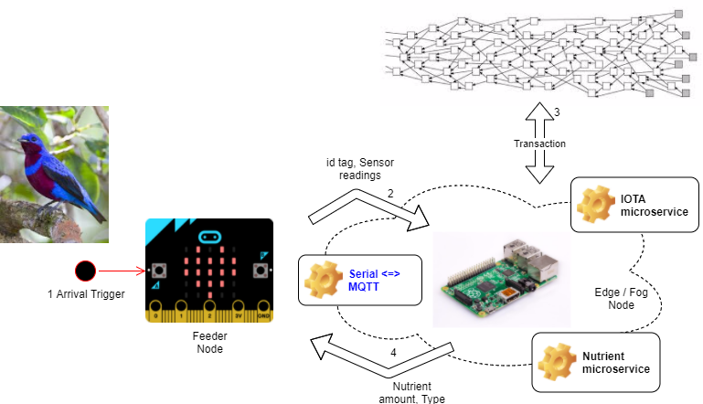
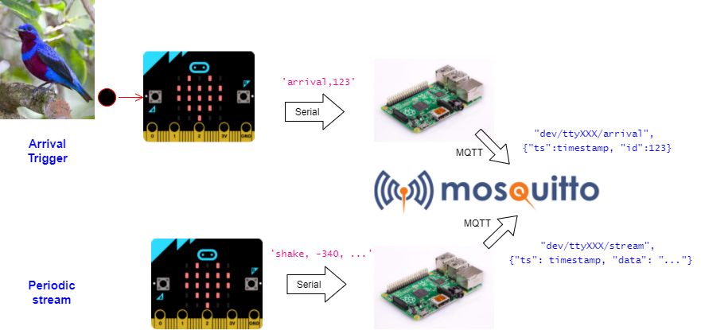

# Day2 Workshop

## Use Case - IOTA micro vending machine



You work in an animal wildlife sanctuary and take care of a flock of endangered bird species that frequently visit the sanctuary. Due to environmental pollution, the birds need additional nutrients to survive long term.

To improve the health of the birds, the wildlife conservation agency has decided to enhance the bird food with supplementary nutrients. You’ve installed smart feeders scattered across the sanctuary, connected to cellular networks.

The nutrient feeding system needs to meet these requirements:
- Each bird should only consume an optimum amount of supplements assigned to it (no overdose!)
- Unauthorised birds/non-birds should not consume the nutrients
- Provide different mixes of supplements, depending on environmental conditions

This can be solved in a variety of ways. The key advantages that IOTA offers:
- Distributed ledger eliminates the need to centralise and dispatch the feed requests
- Decouples the feeders (producers) from the birds (consumers)
- Built-in way to uniquely identify the feeders and birds
- Supports fine-grained (micro) transactions

Proposed solution using IOTA
- Create an IOTA address for the feeder which is used for monitoring when new funds are added
- Each bird has a QR code attached (in a humane way) pointing to its IOTA wallet
- When a bird visits a feeder:
  1. Scan the bird’s QR code to get its IOTA wallet
  2. Release supplements and deduct from the bird’s balance as it consumes the food. 
  3. Stop adding supplements if the balance is empty.
- [Not covered in workshop] A central system that:
  - Monitors and replenishes the birds’ IOTA wallets based on demand and prescription
  -  Monitors and replenishes the feeders based on transaction volume

## Architecture


## Microbit to MQTT relay


## Installation
### Setting up test IOTA Tangle

Go to: https://github.com/iota-community/one-command-tangle

```
sudo curl -L "https://github.com/docker/compose/releases/download/1.25.0/docker-compose-$(uname -s)-$(uname -m)" -o /usr/local/bin/docker-compose
sudo chmod +x /usr/local/bin/docker-compose
git clone https://github.com/iota-community/one-command-tangle.git
cd one-command-tangle
sudo docker-compose up
```

Add 14265 as inbound port.

To test locally, download IOTA light wallet on laptop: https://github.com/iotaledger/wallet/releases

```
Host: Custom, use http://your_url:14265
Login with seed: SEED99999999999999999999999999999999999999999999999999999999999999999999999999999
```
Note: When you first log into the IOTA Light Wallet, go to RECEIVE > ATTACH TO TANGLE to see your full balance.

### Raspberry Pi

To find the microbit serial port path:
1. Disconnect the Micro:bit
2. `ls /dev/ttyA*`
3. Connect the Micro:bit over USB to the Raspberry Pi
4. `ls /dev/ttyA*`
5. The path is whatever is new in step 4 after the Micro:bit is plugged in. If nothing new comes up, try expand the search path by doing `ls /dev/tty*` instead (note that you'll see a lot more paths here)
6. Launch the docker container **after** connecting the Micro:bit to the Raspberry Pi:
```
cd ~/diec/day2/docker
sh ./launch_docker.sh
```

Running the microservices:
1. Edit `iota_client.py` on the Raspberry Pi to use the URL for your test IOTA Tangle.
2. Generate 1 IOTA seed and address:
```
python3 iota_client.py --gen_address
```
3. Edit feeder/iota_wallets.json. Sender accounts must use the IOTA seed, whereas recipient accounts can use an IOTA address. You basically run steps 1 and 2 three times (where step 2 is optional for the recipient account).
4. Run the microservices in terminals to see what they do:
```
# from one terminal:
python3 nutrient_microservice.py /dev/ttyXXXX

# from another terminal:
python3 iota_microservice.py /dev/ttyXXXX

# from another terminal:
python3 microbit_to_mqtt.py /dev/ttyXXXX
```
5. Flip the Micro:bit left and right, while clicking button A.  If all goes well, you should observe see MQTT traffic. 

| Topic | Publisher | Key Subscriber | Payload |
| -- | -- | -- | -- |
|/dev/ttyXXXX/arrival|microbit_to_mqtt.py|nutrient_microservice.py|arrival trigger with bird identifier|
|/dev/ttyXXXX/stream|microbit_to_mqtt.py|nutrient_microservice.py|sensor stream for id/fingerprinting of bird|
|/dev/ttyXXXX/iota|nutrient_microservice.py|iota_microservice.py|nutrient amounts to request payment for|
|/dev/ttyXXXX/dispenser|iota_microservice.py|microbit_to_mqtt.py|IOTA bundle hash of completed transaction|

After an IOTA transaction is issued and confirmed, the Micro:bit will display the bundle hash on its screen.

### Windows
```
conda create -n iota python=3
conda activate iota

pip install -r docker\requirements.txt
```

Install mosquitto (tested with 64 bit version): https://mosquitto.org/download/
```
cd C:\Program Files\mosquitto
mosquitto.exe
```

To find the microbit serial port path:
1. Connect the Micro:bit over USB. The driver should automatically install (will require admin privileges)
2. Start -> Device Manager
  - Expand Ports (COM & LPT)
  - Look for something like "USB Serial Device (COM4)" (the last digit will change depending on your computer)
3. Now you can do something like `python microbit_test.py COM4`

The remaining instructions to request IOTA accounts and run the services are the same as Raspberry Pi.

## References
- https://github.com/iotaledger/iota.lib.py (curl extension not available for Raspberry Pi)

