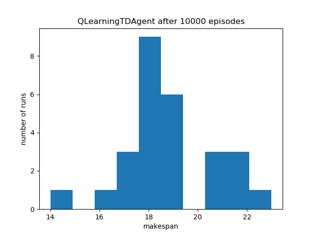

# Reinforcement Learning on Edge Computing

## Path Finding with OpenAI Gym on Raspberry Pi


(Inspiration: http://mnemstudio.org/path-finding-q-learning-tutorial.htm, Futurama)

Explanation of the problem: [Colab Notebook](path_finding_demo.ipynb), [Q-Learning Intro Slides](https://github.com/lisaong/diec/blob/master/day4/rl/some%20intro%20slides.pdf)

Running on Raspberry Pi 3 or 4:
1. Launch the Docker container 
```
cd day4/rl/docker
sh launch_docker.sh
```

2. From the Docker container:
```
cd /code/day4/rl
python3 path_finding_demo.py
```

Output should look like this:
```
...
Action: 3, next state: 3, all actions: [1 2 4], all future rewards: [ 96.27421912  50.38468669 104.93536212], max future reward: 104.935
Current room: 3, Reached goal: False
Action: 1, next state: 1, all actions: [3 5], all future rewards: [ 66.09247435 132.5242206 ], max future reward: 132.524
Current room: 1, Reached goal: False
Action: 5, next state: 5, all actions: [1 4 5], all future rewards: [43.43638317 54.1499565  74.79296194], max future reward: 74.793
Episode finished after 12 timesteps

======Q-values:======
[[  0.           0.           0.           0.         104.8319749
    0.        ]
 [  0.           0.           0.          66.09247435   0.
  135.25523549]
 [  0.           0.           0.          73.19306276   0.
    0.        ]
 [  0.          97.24873486  50.38468669   0.         104.93536212
    0.        ]
 [ 71.78041677   0.           0.          70.00207955   0.
  142.44007268]
 [  0.          43.43638317   0.           0.          54.1499565
   74.79296194]]
======Best paths:======
[0, 4, 5]
[1, 5]
[2, 3, 4, 5]
[3, 4, 5]
[4, 5]
[5, 5]
```

## Job Shop Scheduling with OpenAI Gym on Raspberry Pi


Running on Raspberry Pi 3 or 4:
1. Launch the Docker container 
```
cd day4/rl/docker
sh launch_docker.sh
```

2. From the Docker container:
```
# Install the gym environment, then run the script
cd /code/day4/rl
pip3 -e install gym-jobshop
pip3 install matplotlib
python3 jobshop_scheduling_demo.py
```

Number of successful episodes for 10000 iterations using QLearning:
