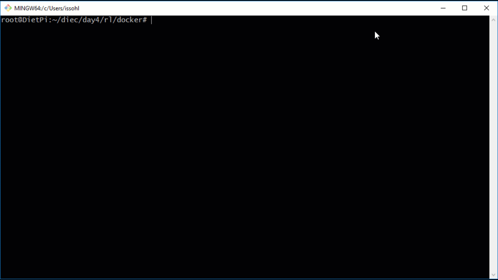
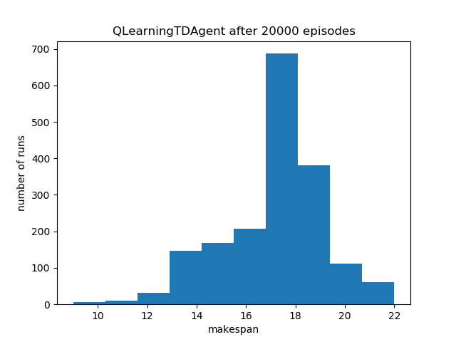

# Reinforcement Learning on Edge Computing

## Path Finding with OpenAI Gym on Raspberry Pi


(Inspiration: http://mnemstudio.org/path-finding-q-learning-tutorial.htm, Futurama)

Explanation of the problem: [Colab Notebook](path_finding/path_finding_demo.ipynb), [Q-Learning Intro Slides](https://github.com/lisaong/diec/blob/master/day4/rl/some%20intro%20slides.pdf)

Running on Raspberry Pi 3 or 4:
1. Launch the Docker container 
```
cd day4/rl/docker
sh launch_docker.sh
```

2. From the Docker container:
```
cd /code/day4/rl/path_finding
python3 path_finding_demo.py
```

Output should look like this:
```
...
Action: 3, next state: 3, all actions: [1 2 4], all future rewards: [ 96.27421912  50.38468669 104.93536212], max future reward: 104.935
Current room: 3, Reached goal: False
Action: 1, next state: 1, all actions: [3 5], all future rewards: [ 66.09247435 132.5242206 ], max future reward: 132.524
Current room: 1, Reached goal: False
Action: 5, next state: 5, all actions: [1 4 5], all future rewards: [43.43638317 54.1499565  74.79296194], max future reward: 74.793
Episode finished after 12 timesteps

======Q-values:======
[[  0.           0.           0.           0.         104.8319749
    0.        ]
 [  0.           0.           0.          66.09247435   0.
  135.25523549]
 [  0.           0.           0.          73.19306276   0.
    0.        ]
 [  0.          97.24873486  50.38468669   0.         104.93536212
    0.        ]
 [ 71.78041677   0.           0.          70.00207955   0.
  142.44007268]
 [  0.          43.43638317   0.           0.          54.1499565
   74.79296194]]
======Best paths:======
[0, 4, 5]
[1, 5]
[2, 3, 4, 5]
[3, 4, 5]
[4, 5]
[5, 5]
```

## Job Shop Scheduling with OpenAI Gym on Raspberry Pi


**State Space:**
We observe the already scheduled tasks, with non-zero start times. Start times of 0 indicate that the task has yet to be scheduled.

Example:
```
{
   'is_scheduled': [0, 0, 1, 0, 5, 0, 10, 1] - tasks 2, 4, 6, 7 already scheduled
                                               tasks 0, 1, 3, 5 not yet scheduled
}
```

**Action Space:**
The action space consists the last scheduled task_id with its non-zero start time.

Example:
```
# Schedule task 8 at start time 10

{
   'task_id' : 8,
   'start_time' : 10
}
```

**Running on Raspberry Pi 3 or 4:**



1. Launch the Docker container 
```
cd day4/rl/docker
sh launch_docker.sh
```

2. From the Docker container:
```
cd /code/day4/rl/jobshop

# Show help options
python3 jobshop_scheduling_demo.py --help

# Run the default agent (Q-Learning) for the default number of episodes (20000)
python3 jobshop_scheduling_demo.py

# Run the Deep Q-Learning agent, for 2000 episodes
python3 jobshop_scheduling_demo.py --agent dqn --episodes 2000
```

### Q-Learning Agent

Number of successful episodes for 20000 iterations using Q-Learning:


Each episode begins with a clean slate, where 8 tasks (for 3 jobs) are to be scheduled on 3 machines. The tasks must run on its assigned machine, and in the specified order in the job.

The episode starts with an action. For example, schedule task_id=3 at start_time=8. 

If a task is scheduled without errors (i.e. no overlap, no out of order tasks), the reward is positive (e.g. 600):
```
Action: OrderedDict([('task_id', 0), ('start_time', 4)]), State: {'is_scheduled': [4, 0, 0, 0, 7, 16, 0, 0]}, Reward: 100, Done: False, Info: {'makespan': 16}
Job-view:
0: Job: 0, Machine: 0, Start: 4, End: 7
1: Job: 0, Machine: 1, Start: 0, End: -1
2: Job: 0, Machine: 2, Start: 0, End: -1
3: Job: 1, Machine: 0, Start: 0, End: -1
4: Job: 1, Machine: 2, Start: 7, End: 8
5: Job: 1, Machine: 1, Start: 16, End: 20
6: Job: 2, Machine: 1, Start: 0, End: -1
7: Job: 2, Machine: 2, Start: 0, End: -1

Machine-view:

Machine 0:
|----|-
    000

Machine 1:
|----|----|----|----
                5555

Machine 2:
|----|--
       4
```

When a task is scheduled with errors (e.g. machine overlap, or out-of-sequence tasks), the reward is negative.
In order for the agent to experience as much as possible, the episode continues on until all tasks are scheduled:
```
Action: OrderedDict([('task_id', 6), ('start_time', 13)]), State: {'is_scheduled': [4, 19, 0, 14, 7, 16, 13, 0]}, Reward: -100, Done: False, Info: {'makespan': 17, 'errors': 'Machine Overlap'}
Job-view:
0: Job: 0, Machine: 0, Start: 4, End: 7
1: Job: 0, Machine: 1, Start: 19, End: 21
2: Job: 0, Machine: 2, Start: 0, End: -1
3: Job: 1, Machine: 0, Start: 14, End: 16
4: Job: 1, Machine: 2, Start: 7, End: 8
5: Job: 1, Machine: 1, Start: 16, End: 20
6: Job: 2, Machine: 1, Start: 13, End: 17
7: Job: 2, Machine: 2, Start: 0, End: -1

Machine-view:

Machine 0:
|----|----|----|
    000       33

Machine 1:
|----|----|----|----|
             6666
                5555
                   11

Machine 2:
|----|--
       4

```

When all episodes are complete, the best schedule based on Q-values stored in the agent will be printed. Note that this schedule can still result in errors when the agent has not learnt an optimum policy (aka the objective of reinforcement learning!)

```
Passing rate: 8.86%

*********Best Schedule*********
Makespan: 3, Errors: None
Makespan: 6, Errors: None
Makespan: 9, Errors: None
Makespan: 10, Errors: Out-of-sequence tasks
Makespan: 12, Errors: Out-of-sequence tasks
Makespan: 14, Errors: Out-of-sequence tasks
Makespan: 16, Errors: None
Makespan: 17, Errors: Out-of-sequence tasks
Job-view:
0: Job: 0, Machine: 0, Start: 11, End: 14
1: Job: 0, Machine: 1, Start: 4, End: 6
2: Job: 0, Machine: 2, Start: 18, End: 20
3: Job: 1, Machine: 0, Start: 8, End: 10
4: Job: 1, Machine: 2, Start: 20, End: 21
5: Job: 1, Machine: 1, Start: 6, End: 10
6: Job: 2, Machine: 1, Start: 13, End: 17
7: Job: 2, Machine: 2, Start: 15, End: 18

Machine-view:

Machine 0:
|----|----|---
        33 000

Machine 1:
|----|----|----|-
    115555   6666

Machine 2:
|----|----|----|----|
               777224

```

Temporal Differencing Q-Learning for single-agent seems too naive to learn the optimum policy quickly, resulting in best schedule with errors. It is still better than the baseline (RandomAgent), which has 0% passing rate.

### Deep Q-Learning Agent

The Deep Q-learning configuration trains one Deep Neural Network per task to predict the Q-values given the state.

**Input**: 1 observation of the current schedule, shape = (number_of_tasks,)

**Output**: Q-values, shape = (max_schedule_length, 1)

**Architecture**: a simple 3-layer MLP
```
for i in range(n_models):
   model = Sequential([
         Dense(input_size*4, input_dim=input_size, activation='relu'),
         Dense(input_size*4, activation='relu'),
         Dense(output_size, activation='linear')
   ])

   # start with a slow learning rate as we are fitting in smaller
   # batches (which will be noiser)
   model.compile(loss='mse', optimizer=Adam(lr=1e-3), metrics=['mae'])
   self.models.append(model)
```

Used Adam with a slow learning rate to reduce noise.

Replay memory is used to update the network every minibatch to improve convergence.

Epsilon decay of 0.995 is applied to encourage early exploration, eventually decaying towards exploitation.

(Reference: https://github.com/srnand/Reinforcement-Learning-using-OpenAI-Gym/blob/master/DQN/cartpole_dqn.py)

Future experiments: Multi-agent learning
